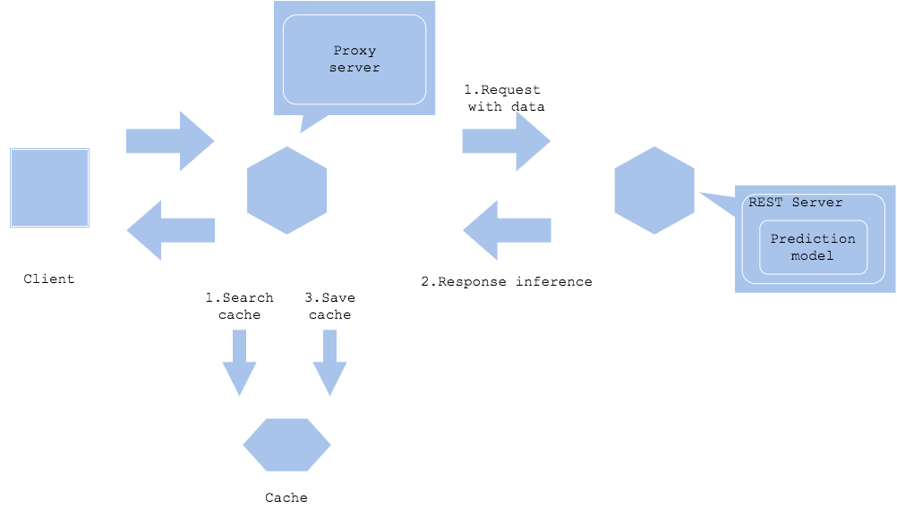
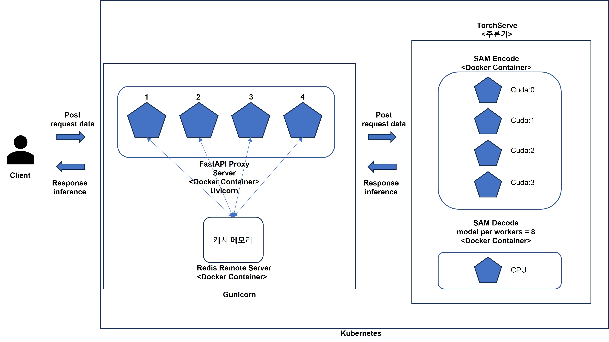

# Labeling Ground API Server

<br>

## Usecase
---
- 동일한 데이터에 대한 예측 요청을 받고, 동일한 데이터를 식별할 수 있는 경우.
- 예측 결과가 자주 변경되지 않는 경우.
- 입력 데이터는 캐시로 검색할 수 있습니다.
- 예측과 오프로드를 가속화합니다.

<br>

## Diagram
---
- **Prediction cache**


<br>

## Architecture
---
API Server의 Prediction cache pattern은 예측 결과를 캐시에 저장해 나중에 반복되는 동일한 데이터에 대한 요청을 검색할 수 있습니다. 서비스가 동일한 데이터에 대해 요청을 받고, 동일 데이터를 식별할 수 있는 `Segment Anything` 모델을 사용함에 있어서 이점을 갖고 있습니다. <br>
예측 서버 또는 프록시는 입력 데이터를 캐시 key로 저장하고 키가 없는 경우 예측 결과를 value로 저장합니다. 캐시가 끝나면 캐시 검색과 예측이 병렬로 실행되며 예측이 완료되기를 기다리지 않고, 캐시가 히트하면 값을 반환합니다. 예측 서버에 대한 부하를 줄여 예측에 걸리는 시간이 단축됩니다. <br>
캐시할 데이터 양은 비용과 볼륨의 균형을 고려해야할 수 있습니다. 캐시 공간은 비용이 더 작은 스토리지나 데이터베이스보다 비싼 경향이 있으므로 **캐시 삭제 정책**을 만드는 것이 중요합니다.
> 아직 캐시 삭제 정책에 대해서 명확하게 확정되지 않았으며, 서비스 하면서 추가적으로 보완하는 작업이 필요합니다. <br>
> 예측 결과가 시간이 지나면 변하는 경우, 오래된 예측으로 응답하지 않도록 오래된 캐시를 지우는 방향으로 캐시 정책을 잡는 것으로 초안을 구상하였습니다. <br>
> 이후 서비스를 함에 있어서 캐시의 크기가 빠르게 증가할 정도로 서비스 로드가 높아지면, 캐시 삭제 정책을 구체적으로 설정하는 방향성을 갖고, 프로그램을 설정하는 것이 중요해 보입니다. 

<br>

- 대부분의 캐시 패턴은 시간이 경과하거나 키의 요청 빈도에 따라 캐시가 지워집니다.

<br>



## Needs consideration
---
- 입력 데이터로 고유하게 식별이 가능해야 합니다.
- 속도, 비용, 볼륨의 트레이드오프를 고려해야 합니다.
- 캐시 정리 정책이 필요합니다.

<br>

> 현재는 30분 동안 사용하지 않은 key는 캐시에서 삭제됩니다.

<br>

## Usage
---
<br>

### Dependency

<br>

- Python >= 3.8
- Docker
- Docker compose 
- Docker-compose.yml == 2.3

<br>

1. Step 01 (Model Serving을 위한 mar 파일 셋업) <br>
: torchserve 를 사용하기 위해서는 inference api로 사용 될 `handler.py` 와 `pretrained model`, `model network` 를 torcharchiver 를 통해 토치 스크립트로 변환 후 `.mar` 확장자로 모든 스크립트와 pretrained model을 묶어둬야 합니다. 아래 과정은 이 작업을 하기위해 진행하는 과정입니다.

`./segment_anything/Dockerfile-build` 경로의 도커 파일을 빌드한 후 스크립트 파일과 모델 pth 파일을 mar 파일로 변환 후 로컬 디렉토리에 저장 및 컨테이너 삭제.

```bash
$ docker build -t sam-builder -f ./segment_naything/Dockerfile-build .
$ docker run -d --name sam-builder1 sam-builder
$ docker cp sam-builder1:/home/model-store ./segment_anything
$ docker rm -f sam-builder1
```

<br>

2. Step 02 (Docker 이미지 빌드) <br>
: proxy, redis, model_serving(sam_encode, sam_decode) 컨테이너를 띄우기 위한 이미지들을 빌드합니다.

```bash
$ make build_all
```

<br>

3. Step 03 (Docker compose 로 각 서비스 가동) <br>
: 이미지(proxy, redis, model_serving) 빌드가 완료가 되었으면, `makefile`에 정의해둔 명령어로 yml 파일을 불러와 모든 컨테이너를 Docker-compose up (run) 명령어를 사용하요 컨테이너를 띄우고 서비스를 가동합니다.

```bash
$ make c_up
```

<br>

4. Step 04 (Docker compose 정지) <br>
: 모든 서비스를 중지하고자 할 때 `makefile`에 미리 정의해둔 c_down 명령어를 통해 모든 컨테이너들을 내리고 삭제합니다.

```bash
$ make c_down
```

<br>

## API 명세서
--- 
**Docker compose로 proxy 컨테이너가 띄워진 상태에서 진행됩니다.**

<br>

1. 작업자의 디바이스 powershell에서 아래와 같은 명령어를 입력합니다. (Windows)
```bash
$ ssh -L 8000:localhost:8000 [host_name]@[host_address] -p [host_port]
$ ssh -L 8000:localhost:8000 xaiplanet@211.115.91.39 -p 9238
```

<br>

2. local device 에서 아래의 도메인을 입력하면 명세서 확인이 가능합니다.
```
http://localhost:8000/docs
http://localhost:8000/redoc
```
